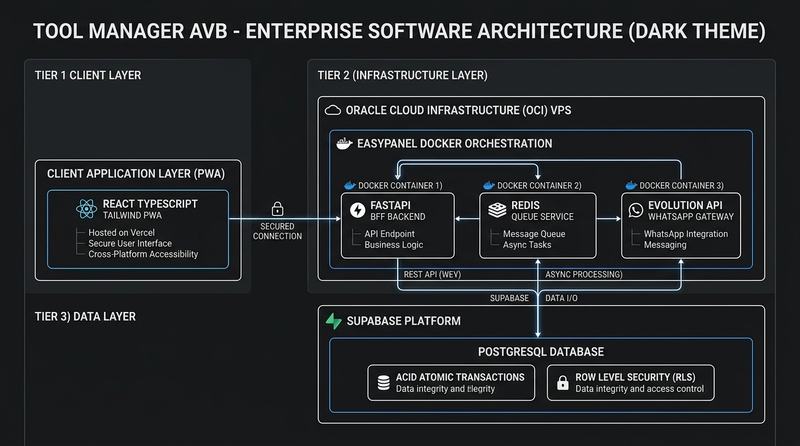

# AVB Tool Manager — Sistema de Gestao e Controle de Ferramentaria

Sistema distribuido para controle transacional, rastreabilidade e auditoria de ferramentas industriais e materiais de consumo, integrado com mensageria assincrona via WhatsApp e agente de inteligencia artificial para suporte operacional.

Disponivel em producao: [https://avb-ferramentaria.vercel.app/](https://avb-ferramentaria.vercel.app/)

---

## 1. Visao Geral da Arquitetura

O sistema adota o padrao **Backend for Frontend (BFF)** desacoplado, com transacoes atomicas ACID no banco de dados e mensageria assincrona orientada a eventos para notificacoes externas, mitigando gargalos de latencia de rede e garantindo integridade absoluta de estoque.



```
[ Cliente Web / PWA ]  --->  (HTTPS / REST)  --->  [ Backend FastAPI BFF ]
(Hospedado na Vercel)                               (Oracle Cloud VPS - Easypanel)
                                                               |
                     +-----------------------------------------+--------------------+
                     |                                                              |
                     v                                                              v
      [ PostgreSQL / Supabase ]                                             [ Redis Queue Service ]
      - Transacoes Atomicas (ACID)                                          - Fila Assincrona (BLPOP)
      - Row-Level Locks (FOR UPDATE)                                        - Dead Letter Queue (DLQ)
      - Row Level Security (RLS)                                            - Politica de Retry Exponencial
                                                                                    |
                                                                                    v
                                                                        [ Evolution API / WhatsApp ]
                                                                        - Mensagens e Fotos das Operacoes
                                                                        - Notificacoes para Grupos e Colaboradores
```

---

## 2. Destaques de Engenharia e Concorrencia

### Transacoes Atomicas ACID (PostgreSQL RPC)
Para prevenir condicoes de corrida (Race Conditions) em cenarios de acessos simultaneos por multiplos operadores, as operacoes de retirada e devolucao utilizam rotinas PL/pgSQL com bloqueio pessimista via `SELECT ... FOR UPDATE`:
- **Consistencia:** Verificacao e decremento de estoque ocorrem no mesmo ciclo transacional.
- **Isolamento:** Bloqueio pontual na linha do item impede retiradas duplicadas quando o saldo disponivel for unitario.
- **Auditoria:** Registro automatico e imutavel na tabela `historico_emprestimos` a cada mutacao.

### Mensageria Resiliente com Fallback Gracioso
O envio de fotos e notificacoes operacionais nao bloqueia a thread de resposta HTTP do cliente:
- A requisicao transacional conclui no banco em milissegundos e o payload da mensagem e enfileirado no Redis.
- Um worker assincrono (`aioredis` com `BLPOP`) processa a fila de despacho em segundo plano.
- **Dead Letter Queue (DLQ):** Falhas persistentes apos 3 tentativas sao roteadas para `fila:whatsapp:falhas_dlq` para inspecao e reprocessamento posterior, evitando descarte silencioso de mensagens.
- **Fallback Gracioso:** Na indisponibilidade do broker Redis, o sistema commuta automaticamente para execucao desacoplada em memoria via tasks assincronas.

### Seguranca e Observabilidade
- **Rate Limiting:** Protecao perimetral via `slowapi` limitando abuso de chamadas por IP.
- **Autenticacao em Camadas:** Tokens de autorizacao via headers (`X-API-Key`) e validacao de assinaturas em endpoints de webhook.
- **Health Check e Metricas:** Endpoint `GET /` com telemetria em tempo real do estado de conexao com o Redis, tamanho da fila principal e contagem da DLQ.
- **Pipeline de Integracao Continua (CI):** Workflows automatizados via GitHub Actions com execucao de suite de testes unitarios em ambiente isolado a cada push ou pull request.

---

## 3. Interface e Fluxos Operacionais

### Painel Principal e Selecao Operacional
Entrada rapida para os fluxos de retirada, devolucao e relatorios gerenciais.


---

### Selecao de Categorias (Ferramentas vs Materiais)
Separacao de fluxo entre ativos permanentes rastreaveis (ferramentas) e insumos de consumo imediato (materiais).


---

### Catalogo de Ferramentas e Inventario
Listagem dinamica com busca por TAG ou denominacao, exibindo status de disponibilidade e reservas em tempo real.


---

### Registro Fotografico Obrigatorio
Evidencia visual da condicao do equipamento no momento da movimentacao para conformidade operacional.


---

### Gestao de Emprestimos Ativos
Painel de controle por funcionario, permitindo solicitacao imediata de devolucao via WhatsApp com um clique.


---

### Administracao e Cadastro de Estoque
Cadastro, edicao e controle quantitativo de ferramentas com codigo de rastreio e localizacao de armazenamento.


---

### Rastreabilidade e Historico de Materiais
Auditoria cronologica de consumo de materiais por colaborador, matricula e data de expedicao.


---

## 4. Stack Tecnologica

### Frontend (Client Tier)
- **Framework:** React 18 + Vite
- **Linguagem:** TypeScript
- **Estilizacao:** Tailwind CSS + Radix UI (shadcn/ui)
- **Gerenciamento de Estado de Rede:** TanStack React Query
- **Roteamento:** React Router v6
- **Deploy:** Vercel

### Backend (Application & BFF Tier)
- **Framework:** FastAPI (Python 3.11+)
- **Servidor ASGI:** Uvicorn
- **Rate Limiting:** SlowAPI
- **Validacao e Esquemas:** Pydantic v2
- **IA e LLM Integration:** OpenAI API (Function Calling estruturado)
- **Testes:** Pytest + Pytest-Asyncio + Unittest Mock
- **CI/CD:** GitHub Actions

### Infraestrutura e Servicos (Platform Tier)
- **Hospedagem VPS:** Oracle Cloud Infrastructure (OCI)
- **Gerenciamento de Containers:** Easypanel / Docker
- **Banco de Dados:** Supabase PostgreSQL com funcoes RPC e RLS
- **Mensageria e Cache:** Redis (Redis Cloud / Docker)
- **Gateway WhatsApp:** Evolution API v2

---

## 5. Como Executar Localmente

### Pre-requisitos
- Node.js 18+
- Python 3.11+
- Git

### 1. Clonar o Repositorio
```bash
git clone https://github.com/Alan-silva01/tool-manager-backend.git
cd tool-manager-backend
```

### 2. Configurar e Rodar o Frontend
```bash
# Instalacao das dependencias
npm install

# Inicializacao em ambiente de desenvolvimento
npm run dev
```
Acesse `http://localhost:5173`.

### 3. Configurar e Rodar o Backend
```bash
cd backend

# Criacao e ativacao do ambiente virtual
python3 -m venv venv
source venv/bin/activate  # No Windows: venv\Scripts\activate

# Instalacao das dependencias
pip install -r requirements.txt

# Copia e preenchimento das variaveis de ambiente
cp .env.example .env

# Execucao dos testes unitarios
pytest -v

# Inicializacao do servidor
python main.py
```
A API estara disponivel em `http://localhost:8001`. Documentacao Swagger automatica em `http://localhost:8001/docs`.

---

## 6. Licenca

Projeto desenvolvido para controle interno e automacao operacional da Ferramentaria AVB.
Todos os direitos reservados.
